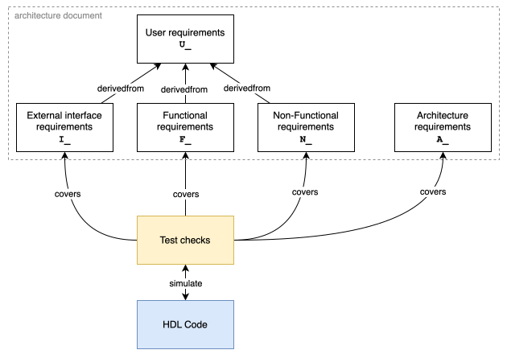

Introduction
============

Purpose
-------

This documents aims at defining the requirements for ECAP5-DPROC as well as describing its architecture. Both user and product requirements will be covered.

Intended Audience and Use
-------------------------

This document targets hardware engineers who shall implement ECAP5-DPROC by refering to the described architecture. It is also intended for system engineers working on the integration of ECAP5-DPROC in ECAP5. Finally, this document shall be used as a technical reference by software engineers configuring ECAP5-DPROC through hardware-software interfaces.

Product Scope
-------------

ECAP5-DPROC is an implementation of the RISC-V instruction set architecture targetting *Educational Computer Architecture Platform 5* (ECAP5). It will provide the main means of software execution in ECAP5.

Conventions
-----------

Requirement format
^^^^^^^^^^^^^^^^^^

This document details requirements with the following format :

.. list-table:: Sample requirement
  :width: 100%
  :widths: 10 90

  * - **ID**
    - Requirement_ID

  * - **Description**
    - Requirement description

  * - **Rationale**
    - Requirement rationale

  * - **DerivedFrom**
    - Other_Requirement_ID

with requirement IDs having the following format :

  * ``U_*``: User requirements
  * ``I_*``: External interface requirements
  * ``F_*``: Functional requirements
  * ``N_*``: Non-Functional requirements
  * ``A_*``: Architecture requirements

The requirement hierarchy and traceability scheme is detailed in the following figure.

   
   Requirement hierarchy and traceability

Definitions and Abbreviations
-----------------------------

**hardware-configurable**
  A hardware-configurable property shall be configurable during the design elaboration phase through the used of verilog module's parameters for instance.

**software-configurable**
  A software-configurable property shall be configurable with software through memory-mapped registers for instance.

References
----------

.. list-table::
  :header-rows: 1
  :widths: 25 10 65
  
  * - Date
    - Version
    - Title

  * - December 13, 2019
    - 20191213
    - The RISCV-V Instruction Set Manual Volume I: User-Level ISA
  * - March 22, 2019
    - 0.13.2
    - RISC-V External Debug Support
  * - June 22, 2010
    - B.4
    - WISHBONE System-on-Chip (SoC) Interconnection Architecture for Portable IP Cores
