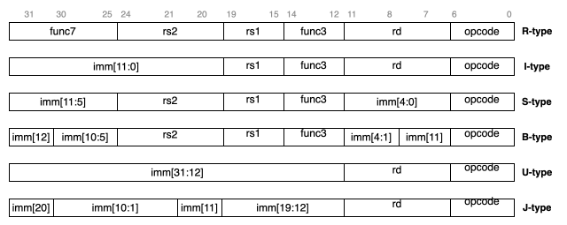
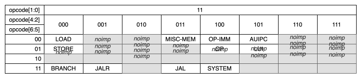
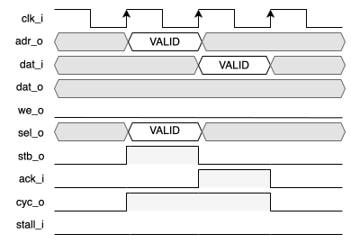
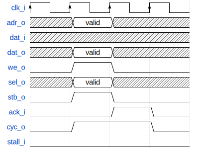

Requirements
============

External Interface Requirements
-------------------------------

.. list-table:: ECAP5-DPROC control signals
  :header-rows: 1
  :width: 100%
  :widths: 10 10 10 70

  * - Name
    - Type
    - Width
    - Description

  * - clk_i
    - I
    - 1
    - Clock input.
  * - rst_i
    - I
    - 1
    - Hardware reset.
  * - irq_i
    - I
    - 1
    - External interrupt request.

.. requirement:: I_CLK_01

   ECAP5-DPROC's outputs shall be registered on the rising edge of clk_i.

.. requirement:: I_RESET_01
   :derivedfrom: U_RESET_01

   The rst_i signal shall hold ECAP5-DPROC in a reset state while asserted.

.. requirement:: I_IRQ_01
   :derivedfrom: U_HARDWARE_INTERRUPT_01, U_HARDWARE_INTERRUPT_02

    ECAP5-DPROC shall interrupt its execution flow when input irq_i is asserted and jump to a hardware-configurable address.

.. list-table:: ECAP5-DPROC memory interface signals
  :header-rows: 1
  :width: 100%
  :widths: 10 10 10 70

  * - Name
    - Type
    - Width
    - Description

  * - wb_adr_o
    - O
    - 32
    - The address output array is used to pass binary address.
  * - wb_dat_i
    - I
    - 32
    - The data input array is used to pass binary data.
  * - wb_dat_o
    - O
    - 32
    - The data output array is used to pass binary data.
  * - wb_sel_o
    - O
    - 4
    - The select output array indicates where valid data is expected on the wb_dat_i signal array during READ cycles, and where it is placed on the wb_dat_o signal array during WRITE cycles. Each individual select signal correlates to one of four active bytes on the 32-bit data port.
  * - wb_we_o
    - O
    - 1
    - The write enable output indicates whether the current local bus cycle is a READ or WRITE cycle. This signal is negated during READ cycles and is asserted during WRITE cycles.
  * - wb_stb_o
    - O
    - 1
    - The strobe output indicates a valid data transfer cycle. It is used to qualify various other signals on the interface.
  * - wb_ack_i
    - I
    - 1
    - The acknowledge input, when asserted, indicates the normal termination of a bus cycle.
  * - wb_cyc_o
    - O
    - 1
    - The cycle output, when asserted, indicates that a valid bus cycle is in progress. This signal is asserted for the duration of all bus cycles.
  * - wb_stall_i
    - O
    - 1
    - The pipeline stall input indicates that current slave is not able to accept the transfer in the transaction queue.

Functional Requirements
-----------------------

Register file
^^^^^^^^^^^^^

.. requirement:: F_REGISTER_01
   :derivedfrom: U_INSTRUCTION_SET_01
  
   ECAP5-DPROC shall implement 32 user-accessible general purpose registers ranging from x0 to x31.

.. requirement:: F_REGISTER_02
   :derivedfrom: U_INSTRUCTION_SET_01

   Register x0 shall always be equal to zero.

.. requirement:: F_REGISTER_03
   :derivedfrom: U_INSTRUCTION_SET_01

   ECAP5-DPROC shall implement a pc register storing the address of the current instruction.

.. requirement:: F_REGISTER_RESET_01
   :derivedfrom: U_BOOT_ADDRESS_01

   The pc register shall be loaded with an hardware-configurable address when ECAP5-DPROC leaves its reset state.

Instruction decoding
^^^^^^^^^^^^^^^^^^^^

The following figure outlines the different instruction encodings for the RV32I instruction set. The instruction encoding is infered from the opcode as there can only be one encoding per opcode.



   RISC-V instruction encodings

Immediate encoding
^^^^^^^^^^^^^^^^^^

Only one immediate value can be encoded in one instruction. The value can be reconstructed from fragments of the following format : imm[x] representing the x :sup:`th` bit or imm[x:y] representing bits from the xth to the yth both included.

.. requirement:: F_INSTR_IMMEDIATE_01
  :derivedfrom: U_INSTRUCTION_SET_01

  Immediate values shall be sign-extended.

.. requirement:: F_INSTR_IMMEDIATE_02
  :derivedfrom: U_INSTRUCTION_SET_01

  The value of an instruction immediate shall be the concatenation of immediate fragments from the instruction encoding.

.. requirement:: F_INSTR_IMMEDIATE_03
  :derivedfrom: U_INSTRUCTION_SET_01

  Missing immediate fragments shall be replaced by zeros.

Opcodes
^^^^^^^

The following table outlines the different opcodes values of the RV32I instruction set.



   RISC-V instruction opcodes

.. note:: Cells marked as *noimp* are for opcodes that are not implemented in version 1.0.0.

.. requirement:: F_OPCODE_ENCODING_01
   :derivedfrom: U_INSTRUCTION_SET_01

   Instructions with the following opcodes shall be decoded as an R-type instruction : OP.

.. requirement:: F_OPCODE_ENCODING_02
   :derivedfrom: U_INSTRUCTION_SET_01

   Instructions with the following opcodes shall be decoded as an I-type instruction : JALR, LOAD, OP-IMM, MISC-MEM and SYSTEM.

.. requirement:: F_OPCODE_ENCODING_03
   :derivedfrom: U_INSTRUCTION_SET_01

   Instructions with the following opcodes shall be decoded as an S-type instruction : STORE.

.. requirement:: F_OPCODE_ENCODING_04
   :derivedfrom: U_INSTRUCTION_SET_01

   Instructions with the following opcodes shall be decoded as an B-type instruction : BRANCH.

.. requirement:: F_OPCODE_ENCODING_05
   :derivedfrom: U_INSTRUCTION_SET_01

   Instructions with the following opcodes shall be decoded as an U-type instruction : LUI and AUIPC.

.. requirement:: F_OPCODE_ENCODING_06
   :derivedfrom: U_INSTRUCTION_SET_01

   Instructions with the following opcodes shall be decoded as an J-type instruction : JAL.

Instruction behaviors
^^^^^^^^^^^^^^^^^^^^^

LUI
```

.. requirement:: F_LUI_01
  :rationale: The LUI instruction shall load the 20 upper bits of the instruction immediate into the destination register and fill the remaining bits with zeros. This is the default behavior for instruction immediates as stated in F_INSTR_IMMEDIATE_02 and F_INSTR_IMMEDIATE_03.
  :derivedfrom: U_INSTRUCTION_SET_01

  When the opcode is LUI, the register pointed by the rd field shall be loaded with the immediate value.

AUIPC
`````

.. requirement:: F_AUIPC_01
  :derivedfrom: U_INSTRUCTION_SET_01

  When the opcode is AUIPC, the register pointed by the rd field shall be the signed sum of the immediate value and the address of the instruction.

JAL
```

.. requirement:: F_JAL_01
  :derivedfrom: U_INSTRUCTION_SET_01

  When the opcode is JAL, the pc register shall be loaded with the signed sum of the immediate value and the address of the instruction.

.. requirement:: F_JAL_02
  :rationale: The JAL instruction shall output the address to the following instruction for it to be used as a *return address* in the case of a function call.
  :derivedfrom: U_INSTRUCTION_SET_01

  When the opcode is JAL, the register pointed by the rd field shall be loaded with the address of the instruction incremented by 4.

JALR
````

.. requirement:: F_JALR_01
  :derivedfrom: U_INSTRUCTION_SET_01

  When the opcode is JALR and the func3 field is 0x0, the pc register shall be loaded with the signed sum of the register pointed by the rs1 field and the immediate value.

.. requirement:: F_JALR_02
  :rationale: The JALR instruction shall output the address to the following instruction for it to be used as a *return address* in the case of a function call.
  :derivedfrom: U_INSTRUCTION_SET_01

  When the opcode is JALR and the func3 field is 0x0, the register pointed by the rd field shall be loaded with the address of the instruction incremented by 4.

BEQ
```

.. requirement:: F_BEQ_01
  :derivedfrom: U_INSTRUCTION_SET_01

  When the opcode is BRANCH and the func3 field is 0x0, the pc register shall be loaded with the signed sum of the address of the instruction and the immediate value, if the registers pointed by the rs1 field and the rs2 field are equal.

BNE
```

.. requirement:: F_BNE_01
  :derivedfrom: U_INSTRUCTION_SET_01

  When the opcode is BRANCH and the func3 field is 0x1, the pc register shall be loaded with the signed sum of the address of the instruction and the immediate value, if the registers pointed by the rs1 field and the rs2 field are equal.

BLT
```

.. requirement:: F_BLT_01
  :derivedfrom: U_INSTRUCTION_SET_01

  When the opcode is BRANCH and the func3 field is 0x4, the pc register shall be loaded with the signed sum of the address of the instruction and the immediate value, if the register pointed by the rs1 field is lower than the register pointed by the rs2 field using a signed comparison.

BGE
```

.. requirement:: F_BGE_01
  :derivedfrom: U_INSTRUCTION_SET_01

  When the opcode is BRANCH and the func3 field is 0x5, the pc register shall be loaded with the signed sum of the address of the instruction and the immediate value, if the register pointed by the rs1 field is greater than the register pointed by the rs2 field using a signed comparison.

BLTU
````

.. requirement:: F_BLTU_01
  :derivedfrom: U_INSTRUCTION_SET_01

  When the opcode is BRANCH and the func3 field is 0x6, the pc register shall be loaded with the signed sum of the address of the instruction and the immediate value, if the register pointed by the rs1 field is lower than the register pointed by the rs2 field using an unsigned comparison.

BGEU
````

.. requirement:: F_BGEU_01
  :derivedfrom: U_INSTRUCTION_SET_01

  When the opcode is BRANCH and the func3 field is 0x7, the pc register shall be loaded with the signed sum of the address of the instruction and the immediate value, if the register pointed by the rs1 field is greater than the register pointed by the rs2 field using an unsigned comparison.

LB
``

.. requirement:: F_LB_01
  :derivedfrom: U_INSTRUCTION_SET_01

  When the opcode is LOAD and the func3 field is 0x0, the register pointed by the rd field shall be the 32 bits sign-extended 8-bit value stored in memory at the address specified by the signed sum of the register pointed by the rs1 field and the immediate value.

LH
``

.. requirement:: F_LH_01
  :derivedfrom: U_INSTRUCTION_SET_01

  When the opcode is LOAD and the func3 field is 0x1, the register pointed by the rd field shall be the 32 bits sign-extended 16-bit value stored in memory at the address specified by the signed sum of the register pointed by the rs1 field and the immediate value.

LW
``

.. requirement:: F_LW_01
  :derivedfrom: U_INSTRUCTION_SET_01

  When the opcode is LOAD and the func3 field is 0x2, the register pointed by the rd field shall be the 32-bit value stored in memory at the address specified by the signed sum of the register pointed by the rs1 field and the immediate value.

LBU
```

.. requirement:: F_LBU_01
  :derivedfrom: U_INSTRUCTION_SET_01

  When the opcode is LOAD and the func3 field is 0x4, the register pointed by the rd field shall be the 32 bits zero-extended 8-bit value stored in memory at the address specified by the signed sum of the register pointed by the rs1 field and the immediate value.

LHU
```

.. requirement:: F_LHU_01
  :derivedfrom: U_INSTRUCTION_SET_01

  When the opcode is LOAD and the func3 field is 0x5, the register pointed by the rd field shall be the 32 bits zero-extended 16-bit value stored in memory at the address specified by the signed sum of the register pointed by the rs1 field and the immediate value.

SB
``

.. requirement:: F_SB_01
  :derivedfrom: U_INSTRUCTION_SET_01

  When the opcode is STORE and the func3 field is 0x0, the least-significant byte of the register pointed by the rs2 field shall be stored in memory at the address specified by the signed sum of the register pointed by the rs1 field and the immediate value.

SH
``

.. requirement:: F_SH_01
  :derivedfrom: U_INSTRUCTION_SET_01

  When the opcode is STORE and the func3 field is 0x1, the two least-significant bytes of the register pointed by the rs2 field shall be stored in memory at the address specified by the signed sum of the register pointed by the rs1 field and the immediate value.

SW
``

.. requirement:: F_SW_01
  :derivedfrom: U_INSTRUCTION_SET_01

  When the opcode is STORE and the func3 field is 0x2, the register pointed by the rs2 field shall be stored in memory at the address specified by the signed sum of the register pointed by the rs1 field and the immediate value.

ADDI
````

.. requirement:: F_ADDI_01
  :derivedfrom: U_INSTRUCTION_SET_01

  When the opcode is OP-IMM and the func3 field is 0x0, the register pointed by the rd field shall be loaded with the signed sum of the register pointed by the rs1 field and the immediate value.

SLTI
````

.. requirement:: F_SLTI_01
  :derivedfrom: U_INSTRUCTION_SET_01

  When the opcode is OP-IMM and the func3 field is 0x1, the register pointed by the rd field shall be 1 if the register pointed by the rs1 field is lower than the immediate value using a signed comparison, 0 otherwise.

SLTIU
`````

.. requirement:: F_SLTIU_01
  :derivedfrom: U_INSTRUCTION_SET_01

  When the opcode is OP-IMM and the func3 field is 0x3, the register pointed by the rd field shall be 1 if the register pointed by the rs1 field is lower than the immediate value using an unsigned comparison, 0 otherwise.

XORI
````

.. requirement:: F_XORI_01
  :derivedfrom: U_INSTRUCTION_SET_01

  When the opcode is OP-IMM and the func3 field is 0x4, the register pointed by the rd field shall be the result of a bitwise xor of the register pointed by the rs1 field and the immediate value.

ORI
```

.. requirement:: F_ORI_01
  :derivedfrom: U_INSTRUCTION_SET_01

  When the opcode is OP-IMM and the func3 field is 0x6, the register pointed by the rd field shall be the result of a bitwise or of the register pointed by the rs1 field and the immediate value.

ANDI
````

.. requirement:: F_ANDI_01
  :derivedfrom: U_INSTRUCTION_SET_01

  When the opcode is OP-IMM and the func3 field is 0x7, the register pointed by the rd field shall be the result of a bitwise and of the register pointed by the rs1 field and immediate value.

SLLI
````

.. requirement:: F_SLLI_01
  :derivedfrom: U_INSTRUCTION_SET_01

  When the opcode is OP-IMM and the func3 field is 0x1, the register pointed by the rd field shall be the register pointed by the rs1 field shited left by the number of bits specified in the 5 lowest-significant bits of the immediate value, filling lower bits with zeros.

SRLI
````

.. requirement:: F_SRLI_01
  :derivedfrom: U_INSTRUCTION_SET_01

  When the opcode is OP-IMM, the func3 field is 0x5 and the 30th bit of the immediate value is 0, the register pointed by the rd field shall be the register pointed by the rs1 field shited right by the number of bits specified in the 5 lowest-significant bits of the immediate value, filling upper bits with zeros.

SRAI
````

.. requirement:: F_SRAI_01
  :derivedfrom: U_INSTRUCTION_SET_01

  When the opcode is OP-IMM, the func3 field is 0x5 and the 30th bit of the immediate value is 1, the register pointed by the rd field shall be the register pointed by the rs1 field shited right by the number of bits specified in the 5 lowest-significant bits of the immediate value, filling upper bits with the most-significant bit of the register pointed by the rs1 field.

ADD
```

.. requirement:: F_ADD_01
  :derivedfrom: U_INSTRUCTION_SET_01

  When the opcode is OP, the func3 field is 0x0 and the func7 field is 0x0, the register pointed by the rd field shall be the signed sum of the registers pointed by the rs1 and rs2 fields.

SUB
```

.. requirement:: F_SUB_01
  :derivedfrom: U_INSTRUCTION_SET_01

  When the opcode is OP, the func3 field is 0x0 and the func7 field is 0x20, the register pointed by the rd field shall be the difference of the register pointed by the rs1 field minus the register pointed by the rs2 fields.

SLT
```

.. requirement:: F_SLT_01
  :derivedfrom: U_INSTRUCTION_SET_01

  When the opcode is OP and the func3 field is 0x2, the register pointed by the rd field shall be 1 if the register pointed by the rs1 field is lower than the register pointed by the rs2 field using a signed comparison, 0 otherwise.

SLTU
````

.. requirement:: F_SLTU_01
  :derivedfrom: U_INSTRUCTION_SET_01

  When the opcode is OP and the func3 field is 0x3, the register pointed by the rd field shall be 1 if the register pointed by the rs1 field is lower than the register pointed by the rs2 field using an unsigned comparison, 0 otherwise.

XOR
```

.. requirement:: F_XOR_01
  :derivedfrom: U_INSTRUCTION_SET_01

  When the opcode is OP and the func3 field is 0x4, the register pointed by the rd field shall be the result of a bitwise xor of the registers pointed by the rs1 and rs2 fields.

OR
``

.. requirement:: F_OR_01
  :derivedfrom: U_INSTRUCTION_SET_01

  When the opcode is OP and the func3 field is 0x6, the register pointed by the rd field shall be the result of a bitwise or of the registers pointed by the rs1 and rs2 fields.

AND
```

.. requirement:: F_AND_01
  :derivedfrom: U_INSTRUCTION_SET_01

  When the opcode is OP and the func3 field is 0x7, the register pointed by the rd field shall be the result of a bitwise and of the registers pointed by the rs1 and rs2 fields.

SLL
```

.. requirement:: F_SLL_01
  :derivedfrom: U_INSTRUCTION_SET_01

  When the opcode is OP and the func3 field is 0x1, the register pointed by the rd field shall be the register pointed by the rs1 field shited left by the number of bits specified by the register pointed by the rs2 field, filling lower bits with zeros.

SRL
```

.. requirement:: F_SRL_01
  :derivedfrom: U_INSTRUCTION_SET_01

  When the opcode is OP, the func3 field is 0x5 and the func7 field is 0x0, the register pointed by the rd field shall be the register pointed by the rs1 field shited right by the number of bits specified by the register pointed by the rs2 field, filling upper bits with zeros.

SRA
```

.. requirement:: F_SRA_01
  :derivedfrom: U_INSTRUCTION_SET_01

  When the opcode is OP, the func3 field is 0x5 and the func7 field is 0x0, the register pointed by the rd field shall be the register pointed by the rs1 field shited right by the number of bits specified in the register pointed by the rs2 field, filling upper bits with the most-significant bit of the register pointed by the rs1 field.

FENCE
`````

.. warning:: The FENCE instructions are scoped for version 1.0.0 but are not implemented in version 1.0.0-alpha1.

ECALL
`````

.. warning:: The ECALL instruction is scoped for version 1.0.0 but is not implemented in version 1.0.0-alpha1.

EBREAK
``````

.. warning:: The EBREAK instruction is scoped for version 1.0.0 but is not implemented in version 1.0.0-alpha1.

Exceptions
^^^^^^^^^^

.. requirement:: F_INSTR_ADDR_MISALIGNED_01
  :derivedfrom: U_INSTRUCTION_SET_01

  An Instruction Address Misaligned exception shall be raised when the target address of a taken branch or an unconditional jump is not four-byte aligned.

.. requirement:: F_MISALIGNED_MEMORY_ACCESS_01
  :derivedfrom: U_INSTRUCTION_SET_01

  A Misaligned Memory Access exception shall be raised when the target address of a load/store instruction is not aligned on the referenced type size.

Memory interface
^^^^^^^^^^^^^^^^

Memory accesses
```````````````

.. requirement:: F_MEMORY_INTERFACE_01
  :derivedfrom: U_INSTRUCTION_SET_01

  Both instruction and data accesses shall be handled by a unique external memory interface.

Wishbone protocol
`````````````````

The following requirements are extracted from the Wishbone specification.

.. requirement:: F_WISHBONE_DATASHEET_01
  :derivedfrom: U_MEMORY_INTERFACE_02

  The memory interface shall comply with the Wishbone Datasheet provided in section 2.1.

.. requirement:: F_WISHBONE_RESET_01
  :derivedfrom: U_MEMORY_INTERFACE_02

  The memory interface shall initialize itself at the rising edge of clk_i following the assertion of rst_i.

.. requirement:: F_WISHBONE_RESET_02
  :derivedfrom: U_MEMORY_INTERFACE_02

  The memory interface shall stay in the initialization state until the rising edge of clk_i following the deassertion of rst_i.

.. requirement:: F_WISHBONE_RESET_03
  :derivedfrom: U_MEMORY_INTERFACE_02

  Signals wb_stb_o and wb_cyc_o shall be deasserted while the memory interface is in the initialization state. The state of all other memory interface signals are undefined in response to a reset cycle.

.. requirement:: F_WISHBONE_TRANSFER_CYCLE_01
  :derivedfrom: U_MEMORY_INTERFACE_02

  The memory interface shall assert wb_cyc_o for the entire duration of the memory access.

.. requirement:: F_WISHBONE_TRANSFER_CYCLE_02
  :derivedfrom: U_MEMORY_INTERFACE_02

  Signal wb_cyc_o shall be asserted no later than the rising edge of clk_i that qualifies the assertion of wb_stb_o.

.. requirement:: F_WISHBONE_TRANSFER_CYCLE_03
  :derivedfrom: U_MEMORY_INTERFACE_02

  Signal wb_cyc_o shall be deasserted no earlier than the rising edge of clk_i that qualifies the deassertion of wb_stb_o.

.. requirement:: F_WISHBONE_HANDSHAKE_02
  :derivedfrom: U_MEMORY_INTERFACE_02

  The memory interface must qualify the following signals with wb_stb_o : wb_adr_o, wb_dat_o, wb_sel_o and wb_we_o.

.. requirement:: F_WISHBONE_STALL_01
  :rationale: wb_stall_i is asserted to indicate that the request queue is temporary full and the request shall be resent.
  :derivedfrom: U_MEMORY_INTERFACE_02

  While initiating a request, the memory interface shall hold the state of its outputs until wb_stall_i is deasserted.

.. requirement:: F_WISHBONE_READ_CYCLE_01
  :derivedfrom: U_MEMORY_INTERFACE_02

  A read transaction shall be started by asserting both wb_cyc_o and wb_stb_i, and deasserting wb_we_o.

.. requirement:: F_WISHBONE_READ_CYCLE_02
  :derivedfrom: U_MEMORY_INTERFACE_02

  The memory interface shall conform to the READ cycle detailed in the figure below.


   
   Timing diagram of the wishbone read cycle

.. requirement:: F_WISHBONE_WRITE_CYCLE_01
  :derivedfrom: U_MEMORY_INTERFACE_02

  A write transaction shall be started by asserting wb_cyc_o, wb stb i and wb_we_o.

.. requirement:: F_WISHBONE_WRITE_CYCLE_02
  :derivedfrom: U_MEMORY_INTERFACE_02

  The memory interface shall conform to the WRITE cycle detailed in figure below.


   
   Timing diagram of the wishbone write cycle

.. requirement:: F_WISHBONE_TIMING_01
  :rationale: As long as the memory interface is designed within the clock domain of clk_i, the requirement will be satisfied by using the place and route tool.
  :derivedfrom: U_MEMORY_INTERFACE_02

  The clock input clk_i shall coordinate all activites for the internal logic within the memory interface. All output signals of the memory interface shall be registered at the rising edge of clk_i. All input signals of the memory interface shall be stable before the rising edge of clk_i.

.. note:: BLOCK cycles are not supported in version 1.0.0

Caches
``````

.. note:: Caches are not supported in version 1.0.0

Debugging
^^^^^^^^^

.. warning:: RISC-V Debug Support is scoped for version 1.0.0 but is not supported in version 1.0.0-alpha1.

Non-functional Requirements
---------------------------

N/A
