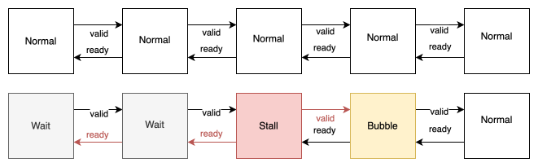
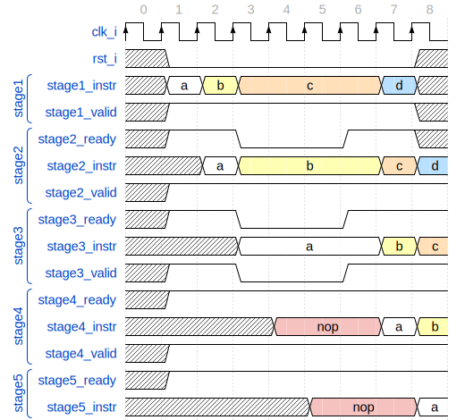

Architecture Overview
=====================

.. figure:: ../assets/architecture.svg
   :align: center

   Diagram of the ECAP5-DPROC architecture

Clock domains
-------------

.. requirement:: A_CLOCK_DOMAIN_01
   :rationale: This is to facilitate the design of version 1.0.0.

   All modules of ECAP5-DPROC shall belong to a unique clock domain.

Functional partitioning
-----------------------

ECAP5-DPROC is built around a pipelined architecture with the following stages :
 * The **instruction fetch** stage loads the next instruction from memory.
 * The **decode** stage handles the instruction decoding to provide the next stage with the different instruction input values including reading from internal registers.
 * The **execute** stage implements all arithmetic and logic operations.
 * The **load/store** stage implements load/store operations.
 * The **write-back** stage which handles storing instructions outputs to internal registers.

.. requirement:: A_FUNCTIONAL_PARTITIONING_01

  The memory module shall arbitrate memory requests from both the fetch module and the loadstore module.

.. requirement:: A_MEMORY_01

   The memory module shall give priority access to the external memory bus for the fetch module.

.. requirement:: A_FUNCTIONAL_PARTITIONING_02
  
  The fetch module shall implement the instruction fetch stage of the pipeline.

.. requirement:: A_INSTRUCTION_FETCH_01
  :rationale: Pipeline stages are all run in parallel.

  The fetch module shall fetch instructions continuously starting on the clock cycle after rst_i is deasserted, providing them to the decode module one after the other.

.. requirement:: A_FUNCTIONAL_PARTITIONING_03

  The decode module shall implement the decode stage of the pipeline.

.. requirement:: A_FUNCTIONAL_PARTITIONING_04

   The register module shall implement the internal general-purpose registers.

.. requirement:: A_FUNCTIONAL_PARTITIONING_05

   The execute module shall implement the execute stage of the pipeline.

.. requirement:: A_FUNCTIONAL_PARTITIONING_06

   The loadstore module shall implement the load/store stage of the pipeline.

.. requirement:: A_FUNCTIONAL_PARTITIONING_07

   The writeback module shall implement the write-back stage of the pipeline.

.. requirement:: A_WRITEBACK_01

   The writeback module shall perform its operation in a single cycle.

.. requirement:: A_FUNCTIONAL_PARTITIONING_08

  The hazard module shall handle the detection of data and control hazards as well as trigger the associated pipeline stalls and pipeline drops.

Hazard management
-----------------

Pipeline stall
^^^^^^^^^^^^^^

In order to handle pipeline stalls, a handshaking mechanism is implemented between each stages, allowing the execution flow to be stopped. A stall can be either triggered by a stage itself or requested by the hazard module.

   Diagram of the pipeline stall behavior

Pipeline stages located at the start and end of the pipeline do not implement the bubble and wait modes respectively.

The following points describe the behavior of the different modes :
 * A stage in normal mode shall operate as described by its different functional behaviors.
 * A stage in stall mode shall deassert its input ready signal and output valid signal while waiting to unstall.
 * A stage in bubble mode shall operate as normal but taking a nop instruction as input instead of the data provided by the preceding stage.
 * A stage in wait mode shall deassert its input ready signal and wait until going back to normal mode.

In case of a stall, the stalling stage deasserts its input ready signal leading to preceding stages waiting for completion. The stalling stage deasserts its output valid signal leading to following stages taking a bubble as their input.

The following figure is a timing diagram of the stall behavior of a 5-stage pipeline where the 3 :sup:`rd` stage is stalled on the 4 :sup:`th` cycle. By stalling the 3 :sup:`rd` stage, this example provides a representative visualisation of all the stalling states of the pipeline stages.

    
   Timing diagram of the pipeline stall behavior

.. requirement:: A_PIPELINE_WAIT_01
   :rationale: The loadstore module doesn't need to implement the pipeline wait state as the writeback module performs its operation in a single cycle (refer to A_REGISTER_01).

   The following modules shall implement the pipeline wait state : fetch, decode, execute.

.. requirement:: A_PIPELINE_BUBBLE_01

   The following modules shall implement the pipeline bubble state : decode, execute, loadstore and writeback.

Structural hazard
^^^^^^^^^^^^^^^^^

For the scope of this document, are designated as structural hazards all cases when a stage is unable to finish its processing within the required time before the next clock cycle.

.. requirement:: A_PIPELINE_STALL_01

   The fetch module shall stall the pipeline while performing the memory request. The pipeline shall be unstalled after completing the request.

.. requirement:: A_PIPELINE_STALL_02

   The loadstore module shall stall the pipeline while performing the memory request. The pipeline shall be unstalled after completing the request.

.. note:: It shall be noted that the some of the performance impact of this kind of hazard could be mitigated but this feature is not included in version 1.0.0.

Data hazard
^^^^^^^^^^^

A data hazard occurs when an instruction (A) uses the result of a previous instruction (B) which is still being processed in the pipeline.

A pipeline stall is produced in case of data hazards so that B is able to finish before A uses its result.

.. requirement:: A_HAZARD_01
   :rationale: Stalling the decode module inserts pipeline bubbles to the subsequent modules.

   The hazard module shall issue a stall request to the decode module while a write operation to one of the next registers to be read by decode is to be performed by the following modules : decode (current output), execute, loadstore and writeback.

.. requirement:: A_PIPELINE_STALL_03

   The decode module shall stall the pipeline upon stall request from the hazard module.

.. requirement:: A_PIPELINE_STALL_04
   :rationale: In the case where the data hazard is cause by the current decode output, not clearing the decode module's outputs will lead to the hazard module stalling the decode module indefinitely.

   While stalling the pipeline due to a stall request from the hazard module, the decode module shall clear its outputs.

.. note:: It shall be noted that some of the performance impact of this kind of hazard could be mitigated but this feature is not included in version 1.0.0.

Control hazard
^^^^^^^^^^^^^^

A control hazard occurs when a jump or branch instruction is executed, as instructions following the jump/branch are already being processes through the pipeline when the jump/branch happens.

Instructions following the jump/branch are replaced by a nop instruction through the use of the bubble mode of the pipeline stages. This operation is designated as pipeline drop.

.. requirement:: A_HAZARD_02
   :rationale: The pipeline drop is held asserted for two cycles to flush both the fetch and decode outputs.

   The hazard module shall issue a pipeline drop request to the execute module on the rising edge of clk_i after the execute module has issued a branch request to the fetch module. The pipeline drop request shall be held asserted for two cycles.

.. requirement:: A_PIPELINE_DROP_01

   The execute module shall discard the decode module's output and output a pipeline bubble upon drop request from the hazard module.

.. note:: It shall be noted that some of the performance impact of this kind of hazard could be mitigated but this feature is not included in version 1.0.0.

Module interfaces
-----------------

.. note:: The module's interfaces and functional behaviors are not described further in this document and are left to the designer's judgement.
